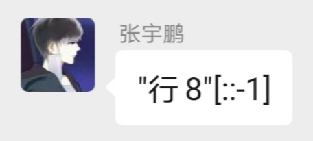

# AITMCLab3

## Content

* Introduction to py2

  useful functions from package AITMCLab

* A simple encryption scheme with prime modulo

  and it is insecure!!

* Quiz 1 (VERY HARD!!!)

## Quick View

* Useful functions: 
* ​    libnum: n2s, s2n, invmod
* ​    Crypto.Util.number: long_to_bytes, bytes_to_long, getPrime, isPrime
* A simple encryption scheme with prime modulo:
* ​    Encryption: $c=m^e(mod\ n)$
* ​    Decryption: $m=c^d(mod\ n)$
* Quiz 1 (VERY VERY VERY HAAARD!!!!!!)
* ​    I have prepared 3 questions, and here is the easiest one. Happy Hacking!

## Acknowledgement

Zhang Yupeng(g0vi), for quiz providing

## Changelog

* 2020.9.26 First version