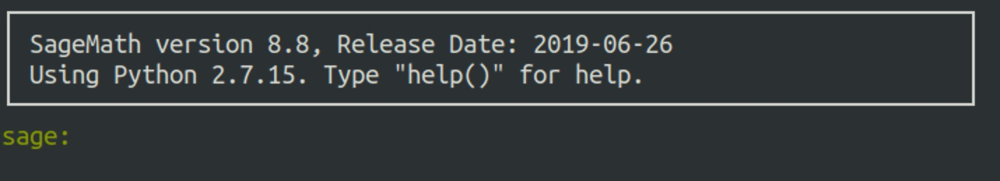
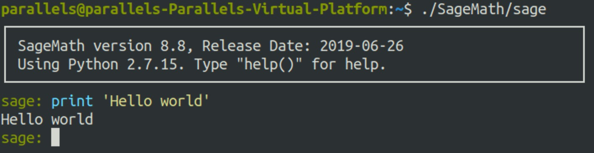

# AITMCLab8-FinalLab

## Content

* [SageMath - Open-Source Mathematical Software System](https://www.sagemath.org/)
* Wiener Attack, with SageMath
* Discrete Logarithm, with SageMath
* Lattice Attack with SageMath: Common Private Exponent RSA
* Final Quiz: Lattice Attack with SageMath: Knapsack

## Lecture Note

### SageMath

**SageMath** is a free [open-source](https://git.sagemath.org/)  mathematics software system licensed under the GPL. It builds on top of many existing  open-source packages: [NumPy](https://numpy.org/),  [SciPy](https://scipy.org/),  [matplotlib](https://matplotlib.org/), [Sympy](https://www.sympy.org/),  [Maxima](http://maxima.sourceforge.net/),  [GAP](https://www.gap-system.org/),  [FLINT](http://www.flintlib.org/),  [R](http://www.r-project.org/) [and many more](https://www.sagemath.org/links-components.html). Access their combined power through a common, Python-based language or directly via interfaces or wrappers.$^{[1]}$

Write your own sage script with suffix `.sage`, run `sage filename.sage` in the shell. Then sage will transform `.sage` file to `py` file named `filename.sage.py` and launch it. 

### SageMath: A Trial

#### Installation (https://www.sagemath.org/download-linux.html)

1. Download `sage-8.8-Ubuntu_18.04-x86_64.tar.bz2` and copy it to **Ubuntu 18.04**
2. Run `tar -xvf sage-8.8-Ubuntu_18.04-x86_64.tar.bz2 && ./SageMath/sage `
3. Everything will be ok as following:



### Hello World (Interactive)

1. `./SageMath/sage`
2. `print 'Hello World'` as python2



### Hello World (Sage Script)

1. `touch helloworld.sage`
2. Edit `helloworld.sage` as following:

``` sage
# Assign list to variable as python2
A = [
    [1/2, 2/3, 3/4],
    [12/13, 11/10, 5/6],
    [15/14, 9/10, 7/8]
]
# Matrix over rational number
A = Matrix(QQ, A)
print 'A:'
print A
print 'A.inverse():'
print A.inverse()
print ''

B = [
    [0, 1, 1],
    [1, 1, 0],
    [0, 0, 1]
]
# Matrix over Finite Field with order 2
B = Matrix(GF(2), B)
print 'B:'
print B
print 'B.inverse():'
print B.inverse()
print ''

P.<x> = GF(2)[]
irreducible_polys = []
for i in range(1 << 8, 1 << 9):
    now_poly = P(list(reversed(map(int, bin(i)[2:]))))
    if now_poly.is_irreducible():
        irreducible_polys.append(now_poly)
print 'number of irreducible poly with deg 8 in GF(2)[x]:', len(irreducible_polys)
for i in range(5):
    print irreducible_polys[i]
```

3. Run `./SageMath/sage helloworld.sage`


### Wiener Attack with Sage

Lecture: https://blog.csdn.net/oumeixi_wjp/article/details/44747329

About continued fraction api: https://doc.sagemath.org/html/en/reference/diophantine_approximation/sage/rings/continued_fraction.html

Hack: `wiener.sage`

### Discrete Logarithm with Sage

Lecture of Pohlig-Hellman algorithm: https://wiki.x10sec.org/crypto/asymmetric/discrete-log/discrete-log/

About discrete logarithm api: https://doc.sagemath.org/html/en/reference/groups/sage/groups/generic.html

Hack: `discrete_log.sage`

### Lattice and LLL algorithm: An Overview

#### Lattice: Definition

In [geometry](https://en.wikipedia.org/wiki/Geometry) and [group theory](https://en.wikipedia.org/wiki/Group_theory), a **lattice** in $\mathbb{R}^n$ is a [subgroup](https://en.wikipedia.org/wiki/Subgroup) of the additive group $\mathbb{R}^n$ which is [isomorphic](https://en.wikipedia.org/wiki/Isomorphic) to the additive group $\mathbb{Z}^n$, and which [spans](https://en.wikipedia.org/wiki/Linear_span) the [real](https://en.wikipedia.org/wiki/Real_number) [vector space](https://en.wikipedia.org/wiki/Vector_space) $\mathbb{R}^n$.$^{[2]}$

A typical lattice $\Lambda$ in $\mathbb{R}^n$ thus has the form


where $(v_1, v_2, \dots, v_n)$ is a basis for $\mathbb{R}^n$.

An example: $\{a(0,1)+b(1,1)\mid a, b\in \mathbb{Z}\}$ is a lattice in $\mathbb{R}^n$, where $n=2$.

An example: $\{a(0,1) + b(1,2)\mid a, b\in \mathbb{Z}\}$ is a lattice in $\mathbb{R}^n$, where $n=2$.

TIP: Different bases can generate the same lattice.

#### LLL algorithm: Shortest Vector Problem (SVP)

Given lattice $\Lambda$ in $\mathbb{R}^n$, calculate
$$
\lambda(\Lambda)=\min_{v\in \Lambda\backslash\{0\}}\lVert v \rVert
$$
It has been shown that SVP is NP-hard.$^{[3]}$

#### LLL algorithm: An Overview

1. Given a basis $(v_1,v_2,\dots,v_n)$ for a lattice $\Lambda $, calculate a new basis $(v_1',v_2',\dots,v_n')$ for the same lattice, which is **BETTER** than the original basis.
2. $v_1'$ is the shortest vector in $\Lambda$ under some condition.
3. More about LLL: https://en.wikipedia.org/wiki/Lenstra%E2%80%93Lenstra%E2%80%93Lov%C3%A1sz_lattice_basis_reduction_algorithm

### Lattice Attack with SageMath: Common Private Exponent RSA

Reading Material: Lattice Based Attack on Common Private Exponent RSA

Hack: `lll_rsa.sage`

### Final Quiz: Lattice Attack with SageMath: Knapsack

Reading Material: https://www.math.ucsd.edu/~crypto/Projects/JenniferBakker/Math187/

Notice that the matrix constructed in this material forms the lattice with column vectors, you need to `transpose` the matrix before applying `LLL` in SageMath.

Quiz: `final_quiz.py`, `data`, `enc`

Solution will be released after DDL.

## Changelog

* 2020.12.24 First version
* 2020.12.24 Add Irreducible Poly to helloworld.sage

## Reference

1. https://www.sagemath.org/
3. https://en.wikipedia.org/wiki/Lattice_(group)
3. https://en.wikipedia.org/wiki/Lattice_problem

